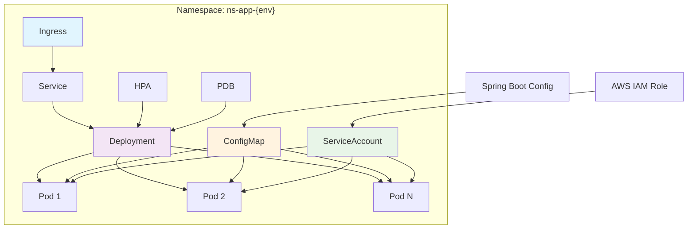

# 🚀 Microservicio Base - Helm Chart

[](https://kubernetes.io/)
[](https://helm.sh/)
[](https://aws.amazon.com/eks/)

**Helm Chart base reutilizable para despliegue estandarizado de microservicios en AWS EKS.** Incluye auto-escalado, alta disponibilidad, IRSA y configuración multi-ambiente.

---

## 📋 Tabla de Contenidos

- [🎯 Características](#-características)
- [🏗️ Arquitectura](#️-arquitectura)
- [⚡ Quick Start](#-quick-start)
- [📁 Estructura](#-estructura)
- [⚙️ Configuración](#️-configuración)
- [🎮 Casos de Uso](#-casos-de-uso)
- [🔧 Troubleshooting](#-troubleshooting)

---

## 🎯 Características

✅ **7 Recursos Kubernetes** - Deployment, Service, Ingress, ConfigMap, HPA, ServiceAccount, PDB  
✅ **Multi-Ambiente** - Variables específicas para dev, staging y producción  
✅ **Auto-Escalado** - HPA basado en CPU/memoria con políticas inteligentes  
✅ **Alta Disponibilidad** - PodDisruptionBudget y múltiples réplicas  
✅ **Seguridad IRSA** - ServiceAccounts con roles AWS sin credenciales  
✅ **ConfigMap Spring Boot** - application.yaml montado como archivo  
✅ **Scripts Automatizados** - Despliegue y renderizado con un comando  
✅ **Ingress Flexible** - Soporte AWS ALB Controller y Nginx  

---

## 🏗️ Arquitectura



---

## ⚡ Quick Start

### Prerequisitos

```bash
# Verificar herramientas
kubectl version --client
helm version
aws --version
```

### Despliegue Rápido

```bash
# 1. Desplegar en desarrollo
./deployment.sh deploy --env dev

# 2. Verificar recursos
kubectl get all -n ns-app-dev -l app=microservicio-app

# 3. Ver logs
kubectl logs -f deployment/microservicio-app-deploy -n ns-app-dev

# 4. Test local
kubectl port-forward service/microservicio-app-svc 8080:80 -n ns-app-dev
curl http://localhost:8080
```

---

## 📁 Estructura

```
base-kubernetes-aplicacion/
├── 📋 app/
│   └── application.yaml                # ⚙️ Config Spring Boot (desarrollador)
├── 🎛️ k8s/                            # 📊 Helm Chart
│   ├── templates/
│   │   ├── configmap.yaml             # 🗂️ ConfigMap con application.yaml
│   │   ├── deployment.yaml            # 🚀 Pods y contenedores
│   │   ├── hpa.yaml                   # 📈 Auto-escalado horizontal
│   │   ├── ingress.yaml               # 🌐 Exposición externa
│   │   ├── pdb.yaml                   # 🛡️ Presupuesto disrupción
│   │   ├── service.yaml               # 🔗 Balanceador interno
│   │   └── serviceaccount.yaml        # 🔐 IRSA AWS
│   ├── Chart.yaml                     # 📋 Metadata Helm
│   └── values.yaml                    # 🎚️ Valores base
├── 🌍 .env.dev                       # 🔧 Variables desarrollo
├── 🌍 .env.staging                   # 🔧 Variables staging
├── 🌍 .env.prod                      # 🔧 Variables producción
├── 🚀 deployment.sh                  # 🤖 Script despliegue
├── 🎨 render-template.sh             # 🖼️ Script renderizado
└── 📖 README.md                      # 📚 Esta documentación
```

### Componentes Clave

| Archivo | Propósito | Mantenido por |
|---------|-----------|---------------|
| `app/application.yaml` | Configuración Spring Boot | Desarrollador |
| `k8s/values.yaml` | Estructura base Helm | DevOps/Git |
| `.env.*` | Variables por ambiente | Library Groups |
| `deployment.sh` | Despliegue automático | DevOps |
| `render-template.sh` | Validación templates | DevOps |

---

## ⚙️ Configuración

### Variables por Ambiente

#### 🔧 Desarrollo (.env.dev)

```bash
# Básico
ENVIRONMENT=dev
NAMESPACE=ns-app-dev
REPLICA_COUNT=3

# Imagen
IMAGE_REGISTRY=docker.io
IMAGE_REPOSITORY=nginx
IMAGE_TAG=1.25-alpine

# Recursos
MEMORY_REQUEST=128Mi
CPU_REQUEST=100m
MEMORY_LIMIT=256Mi
CPU_LIMIT=200m

# Networking
SERVICE_PORT=80
INGRESS_ENABLED=true
INGRESS_CLASS_NAME=alb
INGRESS_PATH=/hello

# Auto-escalado
HPA_ENABLED=true
HPA_MIN_REPLICAS=1
HPA_MAX_REPLICAS=5
HPA_TARGET_CPU=70

# Seguridad
SERVICEACCOUNT_ENABLED=true
SERVICEACCOUNT_IRSA_ROLE_ARN=arn:aws:iam::161156235207:role/Rols3-sa-poc
PDB_ENABLED=true
PDB_MIN_AVAILABLE=1
```

#### 🎯 Staging (.env.staging)

```bash
# Recursos incrementados
NAMESPACE=ns-app-staging
REPLICA_COUNT=2
MEMORY_REQUEST=256Mi
CPU_REQUEST=200m
MEMORY_LIMIT=512Mi
CPU_LIMIT=400m

# Auto-escalado moderado
HPA_MIN_REPLICAS=2
HPA_MAX_REPLICAS=5
```

#### 🏭 Producción (.env.prod)

```bash
# Alta disponibilidad
NAMESPACE=ns-app-prod
REPLICA_COUNT=5
MEMORY_REQUEST=512Mi
CPU_REQUEST=500m
MEMORY_LIMIT=1Gi
CPU_LIMIT=1000m

# Auto-escalado agresivo
HPA_MIN_REPLICAS=3
HPA_MAX_REPLICAS=10
PDB_MIN_AVAILABLE=2
```

### Configuración Spring Boot

```yaml
# app/application.yaml - Mantenido por desarrollador
server:
  port: 8080

spring:
  application:
    name: microservicio-app
  datasource:
    url: jdbc:postgresql://db-dev.internal:5432/myapp_dev
    username: myapp_user

management:
  endpoints:
    web:
      exposure:
        include: health,info,metrics
  health:
    readiness:
      enabled: true
    liveness:
      enabled: true
```

---

## 🎮 Casos de Uso

### 1. 🚀 Nginx Básico

```bash
# Configurar
cd base-kubernetes-aplicacion
export IMAGE_REPOSITORY=nginx
export IMAGE_TAG=1.25-alpine

# Desplegar
./deployment.sh deploy --env dev

# Verificar
kubectl get pods -n ns-app-dev
```

### 2. 🌱 Spring Boot con ConfigMap

```bash
# Editar configuración
cat > app/application.yaml << EOF
server:
  port: 8080
spring:
  application:
    name: my-spring-app
management:
  endpoints:
    web:
      exposure:
        include: health,info
EOF

# Configurar variables
export IMAGE_REPOSITORY=my-company/spring-app
export IMAGE_TAG=v1.2.3
export CONFIGMAP_ENABLED=true

# Desplegar
./deployment.sh deploy --env staging

# Verificar ConfigMap
kubectl describe configmap microservicio-app-cm -n ns-app-staging
```

### 3. 🔍 Renderizado sin Despliegue

```bash
# Renderizar templates
./render-template.sh --env prod

# Revisar manifiestos
ls -la rendered-manifests/
cat rendered-manifests/deployment.yaml

# Validar sintaxis
kubectl apply --dry-run=client -f rendered-manifests/all-manifests.yaml
```

---

## 🔧 Troubleshooting

### Problemas Comunes

#### 🚨 Pod Pending

```bash
# Diagnóstico
kubectl describe pod <pod-name> -n ns-app-dev
kubectl top nodes

# Solución: Ajustar recursos
export MEMORY_REQUEST=64Mi
export CPU_REQUEST=50m
./deployment.sh deploy --env dev
```

#### 🚨 HPA Unknown

```bash
# Verificar Metrics Server
kubectl get pods -n kube-system -l k8s-app=metrics-server

# Instalar si falta
kubectl apply -f https://github.com/kubernetes-sigs/metrics-server/releases/latest/download/components.yaml
```

#### 🚨 Ingress Sin IP

```bash
# Verificar AWS LB Controller
kubectl get pods -n kube-system -l app.kubernetes.io/name=aws-load-balancer-controller

# Ver logs
kubectl logs -n kube-system deployment/aws-load-balancer-controller
```

### Comandos Útiles

```bash
# Estado completo
kubectl get all -n ns-app-dev -l app=microservicio-app

# Eventos recientes
kubectl get events -n ns-app-dev --sort-by='.lastTimestamp'

# Logs en tiempo real
kubectl logs -f deployment/microservicio-app-deploy -n ns-app-dev

# Port forward para testing
kubectl port-forward service/microservicio-app-svc 8080:80 -n ns-app-dev

# Describir recursos
kubectl describe deployment microservicio-app-deploy -n ns-app-dev
kubectl describe hpa microservicio-app-hpa -n ns-app-dev
```

---

## 📚 Scripts Disponibles

### deployment.sh

**Propósito**: Despliegue completo a Kubernetes con Helm

```bash
# Sintaxis
./deployment.sh [COMANDO] [--env AMBIENTE]

# Comandos
./deployment.sh deploy --env dev      # Desplegar
./deployment.sh status --env dev      # Ver estado
./deployment.sh logs --env dev        # Ver logs
./deployment.sh delete --env dev      # Eliminar
```

### render-template.sh

**Propósito**: Renderizar templates sin desplegar

```bash
# Sintaxis
./render-template.sh --env [dev|staging|prod]

# Genera directorio rendered-manifests/ con:
# - all-manifests.yaml (todos los recursos)
# - deployment.yaml, service.yaml, etc. (individuales)
# - diff-with-defaults.txt (diferencias)
```

---

## 🔒 Seguridad

### IRSA (IAM Roles for Service Accounts)

```yaml
# ServiceAccount con IRSA
apiVersion: v1
kind: ServiceAccount
metadata:
  name: microservicio-app-sa
  annotations:
    eks.amazonaws.com/role-arn: arn:aws:iam::123456789012:role/app-role
```

### Configuración por Ambiente

| Ambiente | ServiceAccount | IRSA | PDB |
|----------|---------------|------|-----|
| **Dev** | ✅ | ✅ | ✅ (1 min) |
| **Staging** | ✅ | ✅ | ✅ (1 min) |
| **Prod** | ✅ | ✅ | ✅ (2 min) |

---

<div align="center">

**🚀 Chart listo para producción 🚀**

*Despliegue estandarizado de microservicios en AWS EKS*

</div>