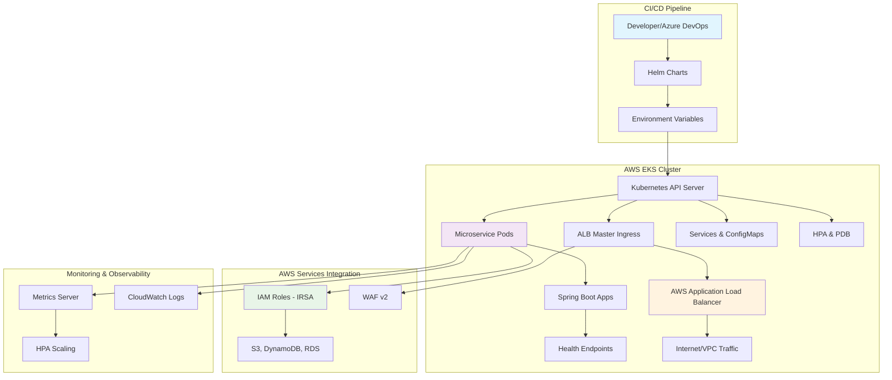
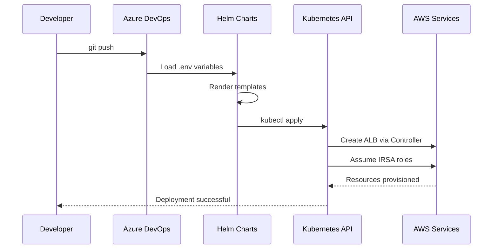

# 🚀 CloudOps Reference Template - Kubernetes & Helm

[](https://kubernetes.io/)
[](https://helm.sh/)
[](https://aws.amazon.com/eks/)
[](LICENSE)

**Plantillas de referencia empresariales para el despliegue estandarizado de microservicios en AWS EKS utilizando Helm Charts.** Incluye configuración multi-ambiente, auto-escalado inteligente, seguridad integrada con IRSA, y gestión centralizada de Application Load Balancers.

---

## 📋 Tabla de Contenidos

- [🎯 Características Principales](#-características-principales)
- [🏗️ Arquitectura](#️-arquitectura)
- [⚡ Quick Start](#-quick-start)
- [📁 Estructura del Proyecto](#-estructura-del-proyecto)
- [⚙️ Configuración](#️-configuración)
- [🎮 Casos de Uso](#-casos-de-uso)
- [🔒 Seguridad](#-seguridad)
- [🔧 Troubleshooting](#-troubleshooting)
- [🤝 Contribución](#-contribución)
- [📚 Recursos Adicionales](#-recursos-adicionales)

---

## 🎯 Características Principales

✅ **Helm Charts Modulares** - Chart base para microservicios y ALB Master centralizado  
✅ **Multi-Ambiente** - Configuración específica para dev, staging y producción  
✅ **Auto-Escalado Inteligente** - HPA basado en CPU/memoria con Metrics Server  
✅ **Alta Disponibilidad** - PodDisruptionBudget y distribución multi-AZ  
✅ **Seguridad Empresarial** - IRSA, ServiceAccounts y WAF integrado  
✅ **Gestión de Configuración** - ConfigMaps con Spring Boot application.yaml  
✅ **Scripts Automatizados** - Despliegue y renderizado con un solo comando  
✅ **Ingress Avanzado** - Soporte para AWS ALB Controller y Nginx  
✅ **Observabilidad** - Health checks, readiness/liveness probes  
✅ **CI/CD Ready** - Integración con Azure DevOps y GitOps  

---

## 🏗️ Arquitectura



### Flujo de Despliegue



---

## ⚡ Quick Start

### Prerequisitos

| Herramienta | Versión Mínima | Instalación |
|-------------|----------------|-------------|
| **kubectl** | 1.21+ | `curl -LO "https://dl.k8s.io/release/$(curl -L -s https://dl.k8s.io/release/stable.txt)/bin/linux/amd64/kubectl"` |
| **Helm** | 3.8+ | `curl https://raw.githubusercontent.com/helm/helm/main/scripts/get-helm-3 \| bash` |
| **AWS CLI** | 2.0+ | `curl "https://awscli.amazonaws.com/awscli-exe-linux-x86_64.zip" -o "awscliv2.zip"` |

### Instalación Rápida

```bash
# 1. Clonar el repositorio
git clone https://github.com/your-org/cloudops-ref-template-k8s-helm.git
cd cloudops-ref-template-k8s-helm

# 2. Configurar acceso al cluster EKS
aws eks update-kubeconfig --region us-east-1 --name your-cluster-name

# 3. Instalar controladores base (una sola vez por cluster)
cd base-kubernetes-transversal
./install-all-controllers.sh

# 4. Desplegar aplicación de ejemplo
cd ../base-kubernetes-aplicacion
./deployment.sh deploy --env dev

# 5. Verificar despliegue
kubectl get all -n ns-app-dev -l app=microservicio-app
```

### Verificación Rápida

```bash
# Comprobar pods corriendo
kubectl get pods -n ns-app-dev

# Probar conectividad
kubectl port-forward service/microservicio-app-svc 8080:80 -n ns-app-dev &
curl http://localhost:8080

# Ver logs de aplicación
kubectl logs -f deployment/microservicio-app-deploy -n ns-app-dev
```

---

## 📁 Estructura del Proyecto

```
cloudops-ref-template-k8s-helm/
├── 📦 base-kubernetes-aplicacion/          # 🎯 Chart principal para microservicios
│   ├── 📋 app/
│   │   └── application.yaml                # ⚙️ Configuración Spring Boot
│   ├── 🎛️ k8s/                            # 📊 Helm Chart principal
│   │   ├── templates/                      # 📝 Templates de Kubernetes
│   │   │   ├── configmap.yaml             # 🗂️ Configuración de aplicación
│   │   │   ├── deployment.yaml            # 🚀 Definición de pods
│   │   │   ├── hpa.yaml                   # 📈 Auto-escalado horizontal
│   │   │   ├── ingress.yaml               # 🌐 Exposición de servicios
│   │   │   ├── pdb.yaml                   # 🛡️ Presupuesto de disrupción
│   │   │   ├── service.yaml               # 🔗 Servicio interno
│   │   │   └── serviceaccount.yaml        # 🔐 Cuenta de servicio IRSA
│   │   ├── Chart.yaml                     # 📋 Metadata del chart
│   │   └── values.yaml                    # 🎚️ Valores por defecto
│   
│   ├── 🌍 .env.dev                       # 🔧 Variables desarrollo
│   ├── 🌍 .env.staging                   # 🔧 Variables staging  
│   ├── 🌍 .env.prod                      # 🔧 Variables producción
│   ├── 🚀 deployment.sh                  # 🤖 Script de despliegue
│   ├── 🎨 render-template.sh             # 🖼️ Script de renderizado
│   └── 📖 README.md                      # 📚 Documentación del chart
├── 🔧 base-kubernetes-transversal/        # 🏗️ Controladores y configuración base
│   ├── install-aws-lb-controller.sh      # 🌐 AWS Load Balancer Controller
│   ├── install-nginx-ingress.sh          # 🔀 Nginx Ingress Controller
│   ├── install-all-controllers.sh        # 🎯 Instalación completa
│   └── README.md                         # 📚 Documentación controladores
├── 📊 VARIABILIZACION.md                 # 🔍 Análisis técnico detallado
├── 🚫 .gitignore                         # 📝 Archivos excluidos
└── 📖 README.md                          # 📚 Esta documentación
```

### Componentes Clave

| Componente | Propósito | Tecnología |
|------------|-----------|------------|
| **base-kubernetes-aplicacion** | Chart reutilizable para microservicios | Helm 3.8+ |

| **base-kubernetes-transversal** | Instalación de controladores base | kubectl + scripts bash |
| **Variables .env** | Configuración por ambiente (Library Groups) | Environment variables |
| **application.yaml** | Configuración interna de aplicaciones | Spring Boot Config |

---

## ⚙️ Configuración

### Variables de Ambiente por Entorno

#### 🔧 Desarrollo (.env.dev)

```bash
# Configuración básica
ENVIRONMENT=dev
NAMESPACE=ns-app-dev
REPLICA_COUNT=3

# Imagen de contenedor
IMAGE_REGISTRY=docker.io
IMAGE_REPOSITORY=nginx
IMAGE_TAG=1.25-alpine

# Recursos computacionales
MEMORY_REQUEST=128Mi
CPU_REQUEST=100m
MEMORY_LIMIT=256Mi
CPU_LIMIT=200m

# Configuración de red
SERVICE_PORT=80
INGRESS_ENABLED=true
INGRESS_CLASS_NAME=alb
INGRESS_PATH=/hello
INGRESS_TLS_ENABLED=false

# Auto-escalado
HPA_ENABLED=true
HPA_MIN_REPLICAS=1
HPA_MAX_REPLICAS=5
HPA_TARGET_CPU=70
HPA_TARGET_MEMORY=80

# Seguridad
SERVICEACCOUNT_ENABLED=true
SERVICEACCOUNT_IRSA_ROLE_ARN=arn:aws:iam::161156235207:role/Rols3-sa-poc
PDB_ENABLED=true
PDB_MIN_AVAILABLE=1
```

#### 🎯 Staging (.env.staging)

```bash
# Configuración optimizada para testing
ENVIRONMENT=staging
NAMESPACE=ns-app-staging
REPLICA_COUNT=2

# Recursos incrementados
MEMORY_REQUEST=256Mi
CPU_REQUEST=200m
MEMORY_LIMIT=512Mi
CPU_LIMIT=400m

# Seguridad habilitada
INGRESS_TLS_ENABLED=true
INGRESS_CERTIFICATE_ARN=arn:aws:acm:us-east-1:123456789012:certificate/12345678-1234-1234-1234-123456789012

# Auto-escalado conservador
HPA_MIN_REPLICAS=2
HPA_MAX_REPLICAS=5
HPA_TARGET_CPU=70
HPA_TARGET_MEMORY=80
```

#### 🏭 Producción (.env.prod)

```bash
# Configuración de alta disponibilidad
ENVIRONMENT=prod
NAMESPACE=ns-app-prod
REPLICA_COUNT=5

# Recursos para producción
MEMORY_REQUEST=512Mi
CPU_REQUEST=500m
MEMORY_LIMIT=1Gi
CPU_LIMIT=1000m

# Seguridad máxima
INGRESS_TLS_ENABLED=true
INGRESS_MTLS_ENABLED=true
WAF_ENABLED=true
WAF_ACL_ARN=arn:aws:wafv2:us-east-1:123456789012:regional/webacl/prod-waf/12345678-1234-1234-1234-123456789012

# Auto-escalado agresivo
HPA_MIN_REPLICAS=3
HPA_MAX_REPLICAS=10
HPA_TARGET_CPU=70
HPA_TARGET_MEMORY=80

# Alta disponibilidad
PDB_MIN_AVAILABLE=2
```

### Configuración de Aplicación (application.yaml)

```yaml
# Configuración Spring Boot montada como ConfigMap
server:
  port: 8080
  servlet:
    context-path: /

spring:
  application:
    name: microservicio-app
  profiles:
    active: ${SPRING_PROFILES_ACTIVE:default}
  
  # Base de datos (ejemplo)
  datasource:
    url: jdbc:postgresql://${DB_HOST:localhost}:${DB_PORT:5432}/${DB_NAME:myapp}
    username: ${DB_USERNAME:myapp_user}
    password: ${DB_PASSWORD:changeme}
    driver-class-name: org.postgresql.Driver

# Actuator para health checks
management:
  endpoints:
    web:
      exposure:
        include: health,info,metrics,prometheus
  endpoint:
    health:
      show-details: always
  health:
    readiness:
      enabled: true
    liveness:
      enabled: true
```

---

## 🎮 Casos de Uso

### 1. 🚀 Microservicio Básico (Nginx)

Despliegue de una aplicación web simple para desarrollo y testing.

```bash
# Configurar variables para desarrollo
cd base-kubernetes-aplicacion
cp .env.dev .env

# Personalizar configuración (opcional)
export IMAGE_REPOSITORY=nginx
export IMAGE_TAG=1.25-alpine
export INGRESS_PATH=/hello

# Desplegar
./deployment.sh deploy --env dev

# Verificar despliegue
kubectl get all -n ns-app-dev -l app=microservicio-app
```

**Output esperado:**
```
NAME                                              READY   STATUS    RESTARTS   AGE
pod/microservicio-app-deploy-7d4b8c8f-abc123      1/1     Running   0          2m

NAME                                TYPE        CLUSTER-IP      EXTERNAL-IP   PORT(S)   AGE
service/microservicio-app-svc       ClusterIP   10.100.123.45   <none>        80/TCP    2m

NAME                                       READY   UP-TO-DATE   AVAILABLE   AGE
deployment.apps/microservicio-app-deploy   1/1     1            1           2m
```

### 2. 🌱 Aplicación Spring Boot con ConfigMap

Despliegue de una aplicación empresarial con configuración externa.

```bash
# Configurar aplicación Spring Boot
cd base-kubernetes-aplicacion

# Editar configuración de aplicación
cat > app/application.yaml << EOF
server:
  port: 8080
spring:
  application:
    name: my-spring-app
  datasource:
    url: jdbc:postgresql://postgres.default.svc.cluster.local:5432/mydb
    username: \${DB_USER}
    password: \${DB_PASS}
management:
  endpoints:
    web:
      exposure:
        include: health,info,metrics
EOF

# Configurar variables para staging
export ENVIRONMENT=staging
export IMAGE_REPOSITORY=my-company/spring-app
export IMAGE_TAG=v1.2.3
export MEMORY_REQUEST=256Mi
export CPU_REQUEST=200m
export CONFIGMAP_ENABLED=true

# Desplegar con TLS habilitado
./deployment.sh deploy --env staging

# Verificar ConfigMap creado
kubectl describe configmap microservicio-app-cm -n ns-app-staging
```

### 3. 🌉 API Gateway con ALB Compartido

Configuración de múltiples servicios detrás de un ALB centralizado.

```bash
# 1. Desplegar ALB Master (una vez por cluster)
cd base-kubernetes-aplicacion/k8s-alb-master

# Configurar ALB compartido
export ALB_GROUP_NAME=shared-alb-prod
export ALB_SCHEME=internet-facing
export ALB_CERTIFICATE_ARN=arn:aws:acm:us-east-1:123456789012:certificate/your-cert
export WAF_ENABLED=true

./deployment.sh prod

# 2. Desplegar múltiples microservicios
cd ../

# Servicio 1: API de usuarios
export SERVICE_NAME=users-api
export INGRESS_PATH=/api/users/*
export IMAGE_REPOSITORY=my-company/users-api
./deployment.sh deploy --env prod

# Servicio 2: API de productos  
export SERVICE_NAME=products-api
export INGRESS_PATH=/api/products/*
export IMAGE_REPOSITORY=my-company/products-api
./deployment.sh deploy --env prod

# Verificar ALB creado
aws elbv2 describe-load-balancers --names k8s-shared-alb-prod
```

---

## 🔒 Seguridad

### Mejores Prácticas Implementadas

#### ✅ Autenticación y Autorización

- **IRSA (IAM Roles for Service Accounts)**: Acceso seguro a AWS sin credenciales hardcodeadas
- **ServiceAccounts**: Identidad única por aplicación
- **RBAC**: Control de acceso basado en roles (implementar según necesidades)

```yaml
# Ejemplo de ServiceAccount con IRSA
apiVersion: v1
kind: ServiceAccount
metadata:
  name: microservicio-app-sa
  annotations:
    eks.amazonaws.com/role-arn: arn:aws:iam::123456789012:role/microservicio-app-role
```

#### ✅ Cifrado y Comunicación Segura

- **TLS automático**: Certificados ACM para HTTPS
- **mTLS**: Autenticación mutua en producción

#### ✅ Seguridad de Red

- **WAF v2**: Protección contra ataques web
- **Security Groups**: Control de tráfico a nivel de red
- **Private subnets**: Pods en subnets privadas

### Checklist de Cumplimiento

| Área | Implementado | Descripción |
|------|-------------|-------------|
| **🔐 Autenticación** | ✅ | IRSA configurado para acceso a AWS |
| **🛡️ Autorización** | ✅ | ServiceAccounts por aplicación |
| **🔒 Cifrado en tránsito** | ✅ | TLS/HTTPS habilitado en staging/prod |
| **🔑 Gestión de secretos** | ✅ | Kubernetes Secrets, no ConfigMaps |
| **🌐 Seguridad de red** | ✅ | WAF, Security Groups configurados |
| **📊 Monitoreo** | ✅ | Health checks y métricas expuestas |
| **🔄 Actualizaciones** | ✅ | Rolling updates sin downtime |
| **💾 Backup** | ⚠️ | Implementar según tipo de datos |
| **🔍 Auditoría** | ⚠️ | CloudTrail para acciones AWS |
| **🚫 Network Policies** | ❌ | Pendiente implementación |

### Configuración de Seguridad por Ambiente

#### Desarrollo
```bash
# Seguridad básica
INGRESS_TLS_ENABLED=false
SERVICEACCOUNT_ENABLED=true
WAF_ENABLED=false
```

#### Staging
```bash
# Seguridad intermedia
INGRESS_TLS_ENABLED=true
INGRESS_CERTIFICATE_ARN=arn:aws:acm:...
SERVICEACCOUNT_ENABLED=true
WAF_ENABLED=false
MTLS_ENABLED=false
```

#### Producción
```bash
# Seguridad máxima
INGRESS_TLS_ENABLED=true
INGRESS_MTLS_ENABLED=true
SERVICEACCOUNT_ENABLED=true
WAF_ENABLED=true
WAF_ACL_ARN=arn:aws:wafv2:...
SECURITY_GROUPS=sg-prod-app,sg-prod-alb
```

---

## 🔧 Troubleshooting

### Problemas Comunes y Soluciones

#### 🚨 Pods en estado Pending

**Síntoma:**
```bash
kubectl get pods -n ns-app-dev
NAME                                    READY   STATUS    RESTARTS   AGE
microservicio-app-deploy-abc123         0/1     Pending   0          5m
```

**Diagnóstico:**
```bash
# Verificar eventos del pod
kubectl describe pod microservicio-app-deploy-abc123 -n ns-app-dev

# Verificar recursos del cluster
kubectl top nodes
kubectl describe nodes
```

**Soluciones:**
- **Recursos insuficientes**: Reducir requests/limits o escalar cluster
- **Taints en nodos**: Agregar tolerations al deployment
- **Affinity rules**: Revisar reglas de afinidad/anti-afinidad

#### 🚨 Ingress sin IP externa

**Síntoma:**
```bash
kubectl get ingress -n ns-app-dev
NAME                          CLASS   HOSTS   ADDRESS   PORTS   AGE
microservicio-app-ingress     alb     *                 80      10m
```

**Diagnóstico:**
```bash
# Verificar AWS Load Balancer Controller
kubectl get pods -n kube-system -l app.kubernetes.io/name=aws-load-balancer-controller

# Verificar logs del controller
kubectl logs -n kube-system deployment/aws-load-balancer-controller

# Verificar eventos del ingress
kubectl describe ingress microservicio-app-ingress -n ns-app-dev
```

**Soluciones:**
```bash
# Reinstalar AWS LB Controller
cd base-kubernetes-transversal
./install-aws-lb-controller.sh

# Verificar permisos IAM del controller
aws iam get-role --role-name AmazonEKSLoadBalancerControllerRole
```

#### 🚨 HPA no escalando

**Síntoma:**
```bash
kubectl get hpa -n ns-app-dev
NAME                    REFERENCE                         TARGETS         MINPODS   MAXPODS   REPLICAS   AGE
microservicio-app-hpa   Deployment/microservicio-app-deploy   <unknown>/70%   1         5         1          5m
```

**Diagnóstico:**
```bash
# Verificar Metrics Server
kubectl get pods -n kube-system -l k8s-app=metrics-server

# Verificar métricas disponibles
kubectl top pods -n ns-app-dev
kubectl top nodes
```

**Soluciones:**
```bash
# Instalar/reiniciar Metrics Server
kubectl apply -f https://github.com/kubernetes-sigs/metrics-server/releases/latest/download/components.yaml

# Verificar resource requests en deployment
kubectl get deployment microservicio-app-deploy -n ns-app-dev -o yaml | grep -A 10 resources
```

### Comandos de Diagnóstico

#### 🔍 Verificación General

```bash
# Estado general del namespace
kubectl get all -n ns-app-dev

# Eventos recientes
kubectl get events -n ns-app-dev --sort-by='.lastTimestamp'

# Logs de aplicación
kubectl logs -f deployment/microservicio-app-deploy -n ns-app-dev

# Descripción detallada de recursos
kubectl describe deployment microservicio-app-deploy -n ns-app-dev
kubectl describe service microservicio-app-svc -n ns-app-dev
kubectl describe ingress microservicio-app-ingress -n ns-app-dev
```

#### 🔍 Verificación de AWS

```bash
# Verificar cluster EKS
aws eks describe-cluster --name your-cluster-name

# Verificar Load Balancers
aws elbv2 describe-load-balancers --names k8s-*

# Verificar Target Groups
aws elbv2 describe-target-groups

# Verificar WAF
aws wafv2 list-web-acls --scope REGIONAL --region us-east-1
```

#### 🔍 Verificación de Red

```bash
# Conectividad interna
kubectl run debug-pod --image=nicolaka/netshoot -it --rm -- /bin/bash
# Dentro del pod:
# nslookup microservicio-app-svc.ns-app-dev.svc.cluster.local
# curl http://microservicio-app-svc.ns-app-dev.svc.cluster.local

# Port forwarding para testing
kubectl port-forward service/microservicio-app-svc 8080:80 -n ns-app-dev

# Verificar DNS interno
kubectl exec -it deployment/microservicio-app-deploy -n ns-app-dev -- nslookup kubernetes.default.svc.cluster.local
```

---

## 🤝 Contribución

### Guía para Desarrolladores

#### 🔄 Proceso de Desarrollo

1. **Fork y Clone**
```bash
git clone https://github.com/your-username/cloudops-ref-template-k8s-helm.git
cd cloudops-ref-template-k8s-helm
```

2. **Crear Branch de Feature**
```bash
git checkout -b feature/nueva-funcionalidad
```

3. **Desarrollo y Testing**
```bash
# Renderizar templates para validación
cd base-kubernetes-aplicacion
./render-template.sh --env dev

# Validar sintaxis
kubectl apply --dry-run=client -f rendered-manifests/

# Testing en cluster de desarrollo
./deployment.sh deploy --env dev
```

4. **Commit y Push**
```bash
git add .
git commit -m "feat: agregar soporte para Redis ConfigMap"
git push origin feature/nueva-funcionalidad
```

#### 🧪 Testing Local

```bash
# 1. Validación de sintaxis Helm
helm lint base-kubernetes-aplicacion/k8s/

# 2. Renderizado de templates
helm template microservicio-app base-kubernetes-aplicacion/k8s/ \
  --values base-kubernetes-aplicacion/k8s/values.yaml \
  --set environment=dev

# 3. Validación con kubeval (opcional)
helm template microservicio-app base-kubernetes-aplicacion/k8s/ | kubeval

# 4. Testing de seguridad con Checkov
checkov -d base-kubernetes-aplicacion/k8s/templates/ --framework kubernetes
```

#### 📋 Estándares de Código

- **Helm Charts**: Seguir [Helm Best Practices](https://helm.sh/docs/chart_best_practices/)
- **YAML**: Usar 2 espacios para indentación
- **Variables**: Usar snake_case para variables de ambiente
- **Comentarios**: Documentar templates complejos
- **Versionado**: Seguir [Semantic Versioning](https://semver.org/)

#### 🔍 Checklist de PR

- [ ] Templates renderizados correctamente
- [ ] Variables documentadas en README
- [ ] Testing en cluster de desarrollo
- [ ] Validación de seguridad con Checkov
- [ ] Documentación actualizada
- [ ] Ejemplos de uso incluidos
- [ ] Backward compatibility mantenida

### Estructura de Commits

```
feat: nueva funcionalidad
fix: corrección de bug
docs: actualización de documentación
style: cambios de formato
refactor: refactorización de código
test: agregar o modificar tests
chore: tareas de mantenimiento
```

---

## 📚 Recursos Adicionales

### 📖 Documentación Oficial

- [Kubernetes Documentation](https://kubernetes.io/docs/)
- [Helm Documentation](https://helm.sh/docs/)
- [AWS EKS User Guide](https://docs.aws.amazon.com/eks/latest/userguide/)
- [AWS Load Balancer Controller](https://kubernetes-sigs.github.io/aws-load-balancer-controller/)

### 🛠️ Herramientas Recomendadas

| Herramienta | Propósito | Instalación |
|-------------|-----------|-------------|
| **k9s** | Dashboard interactivo de Kubernetes | `brew install k9s` |
| **kubectx/kubens** | Cambio rápido de contextos | `brew install kubectx` |
| **stern** | Logs multi-pod | `brew install stern` |
| **helm-diff** | Comparar releases | `helm plugin install https://github.com/databus23/helm-diff` |
| **checkov** | Análisis de seguridad | `pip install checkov` |

### 🎓 Tutoriales y Guías

- [VARIABILIZACION.md](./VARIABILIZACION.md) - Análisis técnico detallado de variables
- [base-kubernetes-aplicacion/README.md](./base-kubernetes-aplicacion/README.md) - Guía del chart principal
- [base-kubernetes-transversal/README.md](./base-kubernetes-transversal/README.md) - Instalación de controladores

### 🆘 Soporte y Comunidad

- **Issues**: [GitHub Issues](https://github.com/your-org/cloudops-ref-template-k8s-helm/issues)
- **Discussions**: [GitHub Discussions](https://github.com/your-org/cloudops-ref-template-k8s-helm/discussions)
- **Slack**: #cloudops-k8s (canal interno)
- **Wiki**: [Confluence - CloudOps Kubernetes](https://your-org.atlassian.net/wiki/spaces/CLOUDOPS)

---

## 📄 Licencia

Este proyecto está licenciado bajo la Licencia MIT - ver el archivo [LICENSE](LICENSE) para más detalles.

---

## 🏷️ Changelog

Ver [CHANGELOG.md](./CHANGELOG.md) para la lista completa de cambios por versión.

**Versión Actual**: v1.0.0  
**Última Actualización**: 2024-01-15

---

<div align="center">

**🚀 ¡Feliz despliegue en Kubernetes! 🚀**

*"La infraestructura como código no es solo una herramienta, es una filosofía que nos permite construir sistemas resilientes, escalables y mantenibles."*

</div>