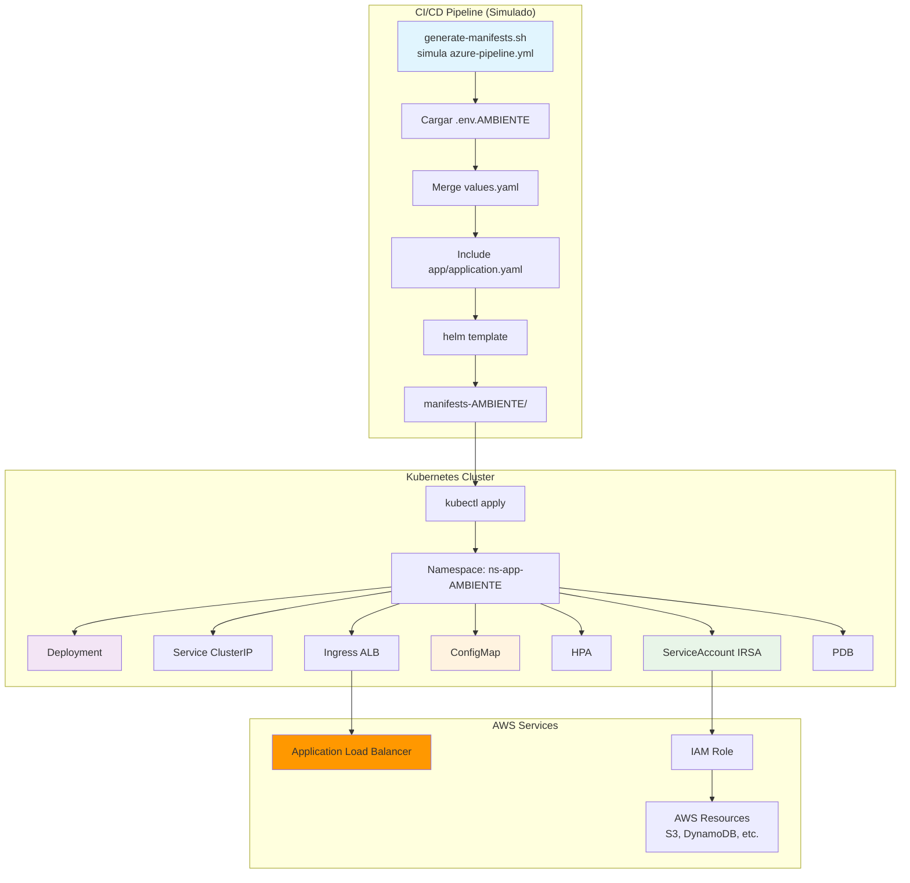
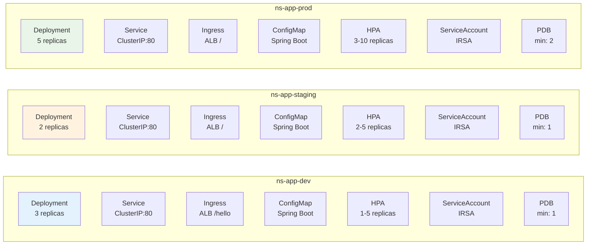
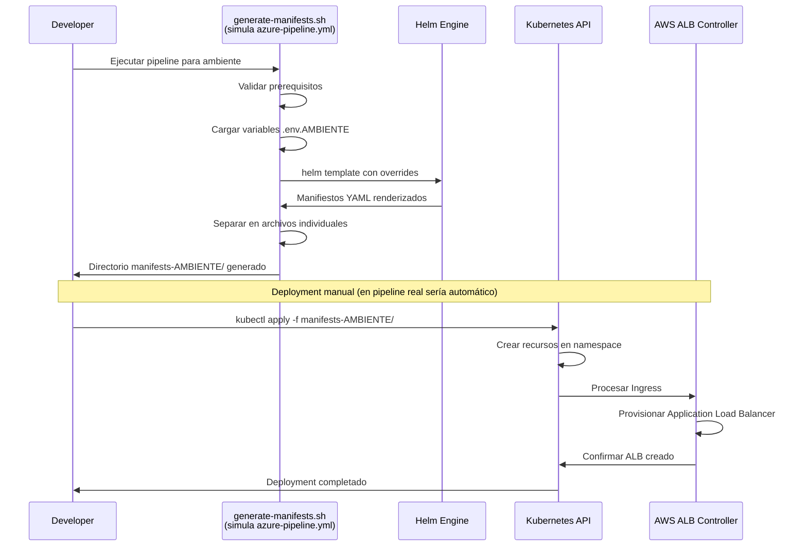

# 🚀 Helm Chart Base - Microservicios AWS EKS

[](https://kubernetes.io/)
[](https://helm.sh/)
[](https://aws.amazon.com/eks/)

**Template base para deployment automatizado de microservicios en AWS EKS usando Helm Charts.** Incluye configuración multi-ambiente, auto-escalado, IRSA y AWS ALB Controller.

---

## 📋 Contenido

- [🎯 Características](#-características)
- [🏗️ Arquitectura](#️-arquitectura)
- [⚡ Inicio Rápido](#-inicio-rápido)
- [📁 Estructura](#-estructura)
- [⚙️ Configuración](#️-configuración)
- [🔄 Pipeline CI/CD](#-pipeline-cicd)
- [🔧 Troubleshooting](#-troubleshooting)

---

## 🎯 Características

✅ **7 Recursos Kubernetes** - Deployment, Service, Ingress, ConfigMap, HPA, ServiceAccount, PDB  
✅ **Multi-Ambiente** - Configuración específica dev/staging/prod  
✅ **AWS ALB Controller** - Ingress con Application Load Balancer únicamente  
✅ **Auto-Escalado** - HPA basado en métricas CPU/memoria  
✅ **Alta Disponibilidad** - PodDisruptionBudget y distribución multi-réplica  
✅ **IRSA** - ServiceAccounts con roles IAM sin credenciales hardcoded  
✅ **ConfigMap Spring Boot** - Montaje de application.yaml como archivo  
✅ **Pipeline Automatizado** - Generación de manifiestos vía script (simula azure-pipeline.yml)  

---

## 🏗️ Arquitectura

### Flujo de Generación de Manifiestos



### Recursos Desplegados por Ambiente



---

## ⚡ Inicio Rápido

### Prerequisitos

```bash
# Verificar herramientas instaladas
helm version    # >= v3.8
kubectl version # >= v1.21
```

### Ejecución del Pipeline (Simulado)

```bash
# Simular pipeline de desarrollo
./generate-manifests.sh dev

# Verificar manifiestos generados
ls -la manifests-dev/

# Aplicar a cluster
kubectl apply -f manifests-dev/all-manifests.yaml
```

---

## 📁 Estructura

```
k8s/
├── templates/                      # Helm templates
│   ├── configmap.yaml             # ConfigMap con application.yaml
│   ├── deployment.yaml            # Deployment principal
│   ├── hpa.yaml                   # HorizontalPodAutoscaler
│   ├── ingress.yaml               # Ingress AWS ALB Controller
│   ├── pdb.yaml                   # PodDisruptionBudget
│   ├── service.yaml               # Service ClusterIP
│   └── serviceaccount.yaml        # ServiceAccount con IRSA
├── .env.dev                       # Variables ambiente desarrollo
├── .env.staging                   # Variables ambiente staging
├── .env.prod                      # Variables ambiente producción
├── Chart.yaml                     # Metadata Helm chart
├── values.yaml                    # Valores base por defecto
├── generate-manifests.sh          # Pipeline script (simula azure-pipeline.yml)
└── README.md                      # Documentación
```

### Manifiestos Generados

| Recurso | Archivo Output | Función |
|---------|---------------|---------|
| **Deployment** | deployment.yaml | Pods aplicación con configuración específica |
| **Service** | service.yaml | Balanceador interno ClusterIP puerto 80 |
| **Ingress** | ingress.yaml | AWS ALB Controller para exposición externa |
| **ConfigMap** | configmap.yaml | Configuración Spring Boot desde app/application.yaml |
| **HPA** | horizontalpodautoscaler.yaml | Auto-escalado basado en CPU/memoria |
| **ServiceAccount** | serviceaccount.yaml | IRSA para acceso a servicios AWS |
| **PDB** | poddisruptionbudget.yaml | Garantía de disponibilidad durante mantenimientos |

---

## ⚙️ Configuración

### Variables por Ambiente

#### Desarrollo (.env.dev)

```bash
ENVIRONMENT=dev
NAMESPACE=ns-app-dev
REPLICA_COUNT=3

# Container image
IMAGE_REGISTRY=docker.io
IMAGE_REPOSITORY=nginx
IMAGE_TAG=1.25-alpine

# Resource allocation
MEMORY_REQUEST=128Mi
CPU_REQUEST=100m
MEMORY_LIMIT=256Mi
CPU_LIMIT=200m

# Service configuration
SERVICE_PORT=80

# ConfigMap
CONFIGMAP_ENABLED=true

# AWS ALB Ingress
INGRESS_ENABLED=true
INGRESS_CLASS_NAME=alb
INGRESS_PATH=/hello
INGRESS_GROUP_ENABLED=true
INGRESS_GROUP_NAME=wrappers
INGRESS_LISTEN_PORTS='[{"HTTP": 80},{"HTTP": 8443}]'
INGRESS_HEALTHCHECK_PATH=/
INGRESS_TARGET_TYPE=ip
INGRESS_BACKEND_PROTOCOL=HTTP
INGRESS_SUCCESS_CODES=200

# Horizontal Pod Autoscaler
HPA_ENABLED=true
HPA_MIN_REPLICAS=1
HPA_MAX_REPLICAS=5
HPA_TARGET_CPU=70
HPA_TARGET_MEMORY=80

# IRSA ServiceAccount
SERVICEACCOUNT_ENABLED=true
SERVICEACCOUNT_IRSA_ROLE_ARN=arn:aws:iam::161156235207:role/Rols3-sa-poc

# Pod Disruption Budget
PDB_ENABLED=true
PDB_MIN_AVAILABLE=1
```

#### Staging (.env.staging)

```bash
ENVIRONMENT=staging
NAMESPACE=ns-app-staging
REPLICA_COUNT=2
MEMORY_REQUEST=256Mi
CPU_REQUEST=200m
MEMORY_LIMIT=512Mi
CPU_LIMIT=400m
HPA_MIN_REPLICAS=2
HPA_MAX_REPLICAS=5
```

#### Producción (.env.prod)

```bash
ENVIRONMENT=prod
NAMESPACE=ns-app-prod
REPLICA_COUNT=5
MEMORY_REQUEST=512Mi
CPU_REQUEST=500m
MEMORY_LIMIT=1Gi
CPU_LIMIT=1000m
HPA_MIN_REPLICAS=3
HPA_MAX_REPLICAS=10
PDB_MIN_AVAILABLE=2
```

### Configuración Spring Boot

```yaml
# ../app/application.yaml
application:
  server:
    port: 8080
  
  spring:
    datasource:
      url: jdbc:postgresql://db-dev.internal:5432/myapp_dev
      username: myapp_user
  
  management:
    endpoints:
      web:
        exposure:
          include: health,info,metrics
    health:
      readiness:
        enabled: true
      liveness:
        enabled: true
```

---

## 🔄 Pipeline CI/CD

### Simulación de Azure Pipeline

El script `generate-manifests.sh` simula el comportamiento de un `azure-pipeline.yml` real:



### Ejecución del Pipeline

```bash
# Pipeline desarrollo
./generate-manifests.sh dev

# Pipeline staging  
./generate-manifests.sh staging

# Pipeline producción
./generate-manifests.sh prod
```

**Output generado:**
```
manifests-dev/
├── all-manifests.yaml              # Todos los recursos combinados
├── configmap.yaml                  # ConfigMap individual
├── deployment.yaml                 # Deployment individual
├── horizontalpodautoscaler.yaml    # HPA individual
├── ingress.yaml                    # Ingress individual
├── poddisruptionbudget.yaml        # PDB individual
├── service.yaml                    # Service individual
├── serviceaccount.yaml             # ServiceAccount individual
├── values-override-dev.yaml        # Valores aplicados por ambiente
└── deployment-info.txt             # Información del deployment
```

### Validación Pre-Deployment

```bash
# Dry-run validation
kubectl apply --dry-run=client -f manifests-dev/all-manifests.yaml

# Diff con deployment actual
kubectl diff -f manifests-dev/all-manifests.yaml

# Lint Helm chart
helm lint .
```

### Deployment

```bash
# Aplicar todos los recursos
kubectl apply -f manifests-dev/all-manifests.yaml

# Verificar deployment
kubectl get all -n ns-app-dev -l app=microservicio-app

# Monitorear rollout
kubectl rollout status deployment/microservicio-app-deploy -n ns-app-dev
```

---

## 🔧 Troubleshooting

### Pipeline Issues

#### Script no ejecuta
```bash
chmod +x generate-manifests.sh
bash generate-manifests.sh dev
```

#### Helm template falla
```bash
# Verificar estructura templates
ls -la templates/

# Validar sintaxis Chart
helm lint .

# Debug template rendering
helm template microservicio-app . --debug
```

#### Variables no se aplican
```bash
# Verificar archivo ambiente existe
ls -la .env.dev

# Revisar valores generados
cat manifests-dev/values-override-dev.yaml
```

### Deployment Issues

#### Ingress sin IP externa
```bash
# Verificar AWS Load Balancer Controller
kubectl get pods -n kube-system -l app.kubernetes.io/name=aws-load-balancer-controller

# Logs del controller
kubectl logs -n kube-system deployment/aws-load-balancer-controller

# Verificar annotations Ingress
kubectl describe ingress microservicio-app-ingress -n ns-app-dev
```

#### HPA muestra métricas Unknown
```bash
# Verificar Metrics Server
kubectl get pods -n kube-system -l k8s-app=metrics-server

# Verificar métricas disponibles
kubectl top pods -n ns-app-dev
kubectl top nodes
```

#### Pods no inician
```bash
# Describir pod con issues
kubectl describe pod <pod-name> -n ns-app-dev

# Verificar eventos namespace
kubectl get events -n ns-app-dev --sort-by='.lastTimestamp'

# Verificar recursos nodo
kubectl describe node <node-name>
```

### Comandos Útiles

```bash
# Estado completo deployment
kubectl get all -n ns-app-dev -l app=microservicio-app

# Logs aplicación
kubectl logs -f deployment/microservicio-app-deploy -n ns-app-dev

# Port-forward para testing local
kubectl port-forward service/microservicio-app-svc 8080:80 -n ns-app-dev

# Escalar manualmente
kubectl scale deployment microservicio-app-deploy --replicas=3 -n ns-app-dev

# Restart deployment
kubectl rollout restart deployment/microservicio-app-deploy -n ns-app-dev

# Historial rollouts
kubectl rollout history deployment/microservicio-app-deploy -n ns-app-dev
```

---

## 📊 Especificaciones Técnicas

### Chart.yaml
```yaml
apiVersion: v2
name: microservicio-base
description: Helm Chart base para despliegue de microservicios en AWS EKS
type: application
version: 1.0.0
appVersion: "1.0.0"
```

### values.yaml - Configuración Base
- **appName**: microservicio-app (fijo)
- **namespace**: default (override por ambiente)
- **image**: docker.io/nginx:1.25-alpine (override por ambiente)
- **replicaCount**: 2 (override por ambiente)
- **resources**: requests/limits configurables
- **service**: ClusterIP puerto 80
- **ingress**: AWS ALB Controller (deshabilitado por defecto)
- **configMap**: Deshabilitado por defecto
- **hpa**: Deshabilitado por defecto
- **serviceAccount**: Deshabilitado por defecto
- **pdb**: Deshabilitado por defecto

### IRSA Configuration

ServiceAccount configurado con annotations para IRSA:

```yaml
apiVersion: v1
kind: ServiceAccount
metadata:
  name: microservicio-app-sa
  annotations:
    eks.amazonaws.com/role-arn: arn:aws:iam::ACCOUNT:role/ROLE_NAME
```

**Configuración por ambiente:**

| Ambiente | IRSA | Role ARN |
|----------|------|----------|
| **dev** | ✅ | Configurado en .env.dev |
| **staging** | ✅ | Configurado en .env.staging |
| **prod** | ✅ | Configurado en .env.prod |

---

## 📚 Referencias

- [Helm Documentation](https://helm.sh/docs/)
- [AWS Load Balancer Controller](https://kubernetes-sigs.github.io/aws-load-balancer-controller/)
- [Kubernetes HPA](https://kubernetes.io/docs/tasks/run-application/horizontal-pod-autoscale/)
- [IRSA Documentation](https://docs.aws.amazon.com/eks/latest/userguide/iam-roles-for-service-accounts.html)

---

<div align="center">

**Template base para microservicios en AWS EKS con pipeline automatizado**

</div>